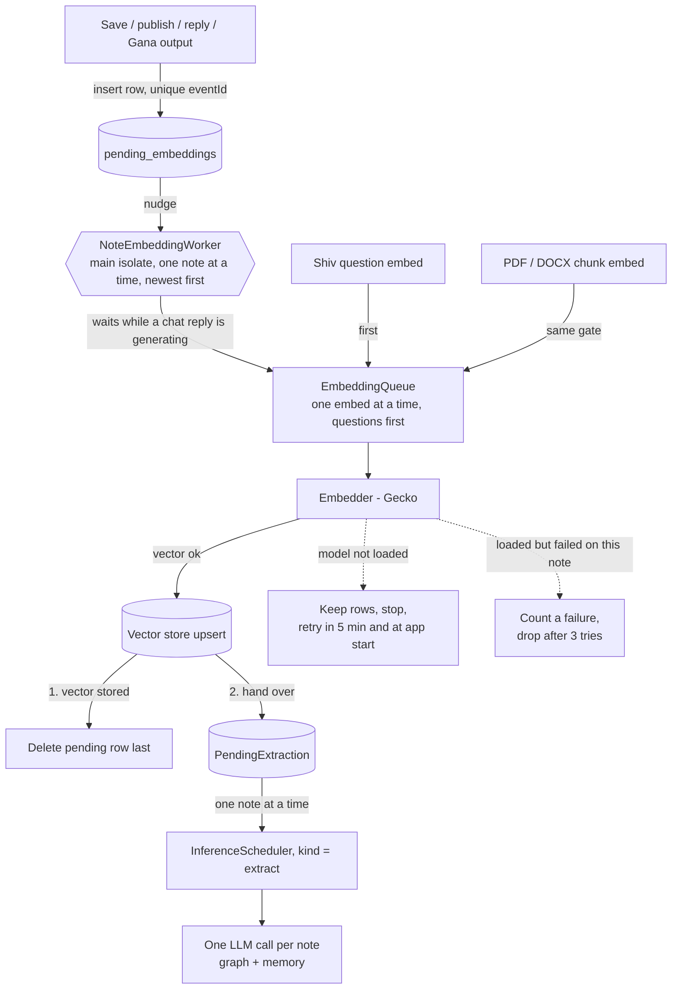

# Embedding — how text becomes a vector

Everything Shiv retrieves is found by similarity between vectors, so the path
from text to vector decides what Shiv can answer. This is how it works today.
Issues: #231 (queue), #125 (batching, not adopted), #232 (store version, not
built), #234 (declared vs real dimension).

## What gets embedded, and when

| Text | Entry point | Priority |
|------|-------------|----------|
| A note the user **saves**, **publishes**, **replies** with, or a **Gana** publishes | `EmbedAndStoreNoteUseCase` → pending table → `NoteEmbeddingWorker` | background |
| A PDF / DOCX / image-text **chunk** | `DocumentIndexer` → `EmbedAndStoreChunkUseCase` | background |
| A Shiv **question** (and Manas context queries) | `EmbeddingService.embed(text)` | interactive |

Feed notes the user only scrolls past, and notes arriving from relays, are not
embedded. A note with fewer than 4 characters after media URLs are stripped is
skipped.

## The pipeline

## The pieces

| Piece | Where | Job |
|-------|-------|-----|
| `PendingEmbeddingModel` / `PendingEmbeddingRepository` | `lib/data/models/`, `lib/data/repositories/` | Notes waiting for a vector. One row per `eventId`, holds the text to embed. Returns `Either<Failure, T>`. |
| `EmbedAndStoreNoteUseCase` | `lib/domain/usecases/vector_usecases.dart` | Strips media URLs, skips text under 4 characters, queues the note, calls the trigger. Never throws. |
| `NoteEmbeddingTrigger` | `lib/domain/services/` | Domain interface (`nudge()`); the worker implements it. |
| `NoteEmbeddingWorker` | `lib/features/shiv/rag/indexing/` | Drains the table. |
| `EmbeddingQueue` | `lib/data/datasources/llm/embedding_queue.dart` | The one gate: one embed in flight, interactive before background. |
| `EmbeddingService` | `lib/features/shiv/rag/embedding/` | Loads Gecko, runs every embed through the gate. |

## Rules

- **A row is deleted only after its vector is stored.** A kill, a crash or a failing store loses nothing; at worst the note is embedded twice.
- **The table only holds notes that still need a vector.** Empty means no work: a pass is one query. There is no polling and no database watcher; the only timer is the 5-minute retry after a failed pass.
- **When it runs:** when a row is added, at app start (`main.dart`), and after the retry timer. It runs only while the app is open; rows wait for the next launch otherwise.
- **One worker, one note at a time, newest first.** A note queued while it runs sets a "go again" flag, so passes never overlap and nothing is stranded.
- **`embed` answers `[]` for two different reasons.** Model not loaded → keep the note, stop, retry later (`EmbeddingService.isReady` is false). Model loaded but no vector for this text → count a failure and drop the note after 3, or one bad note would block the queue forever.
- **A question waits for at most one embed.** When a slot frees, interactive waiters go before queued background ones. The embed already running cannot be interrupted.
- **Chat first.** The worker waits (polls every 2 s) while `InferenceScheduler.isChatRunning`. Gana, extraction and Nataraj jobs do not hold it back.
- **Knowledge extraction is unchanged:** one on-device LLM call per note, scheduled as `extract`, skipped when no model is active, drained when the user is away from Shiv. The worker only feeds it.
- **Always embed through `EmbeddingService.embed`.** A direct call to the model skips the gate.

## Why one at a time

Measured on a vivo 1933 (Snapdragon 710), real Gecko model:

- One embed costs **~11.5 s**, whatever the text: 4 characters 11.54 s, ~200 chars 11.53 s, ~1,500 chars 11.57 s, ~6,000 chars 11.61 s. The forward pass is compiled for a fixed input (the model name says 1024 tokens) and a batch of 1, so every call processes a full padded input.
- One at a time, two at a time, `generateEmbeddings` in groups of 4 and all at once all took the same ~46.3 s for 4 notes (1.00x). In the plugin `generateEmbeddings` is one request per text to a single worker isolate, so batching saves nothing (#125).
- The model returns 768-dimension vectors where the app declares 1024 (#234).

| | Before the queue | After |
|---|---|---|
| One note stored | 12.1 s | 11.8 s |
| Burst of 4 notes saved at once | all four appear together at ~46.5 s | at 12.4, 24.1, 36.1, 47.8 s |
| A Shiv question right after a burst of 4 | answered after 57.9 s | answered after 23.1 s |

A running embed costs a chat reply roughly 10-20 % and the first token almost
nothing (1.58 → 1.65 s), with the chat model on the GPU and the embedder on the
CPU (two alone samples, one contended: indicative only). Faster embedding would
need a model with a shorter fixed input, or the GPU backend loading on weak
phones (it falls back to the CPU on the vivo 1933); neither is done.

## Not covered

- Notes saved before the queue existed that never got a vector, and a store format change (#232): both need a cheap "has a vector" check first, since re-embedding every saved note costs ~11.5 s each on a weak phone.
- A very large PDF/DOCX keeps the embedder busy for minutes (one chunk ≈ 11.5 s); that path is unchanged.

## Tests

- CI: `test/domain/usecases/vector_usecases_test.dart`, `test/data/repositories/pending_embedding_repository_impl_test.dart`, `test/features/shiv/rag/indexing/note_embedding_worker_test.dart`, `test/data/datasources/llm/embedding_queue_test.dart`, `test/features/shiv/rag/embedding/embedding_service_test.dart`, `test/integration/note_embedding_flow_test.dart`, and the note-plus-PDF group in `test/integration/document_rag_flow_test.dart`.
- Device (`integration_test/`, real model): `note_embedding_queue_e2e_test`, `embedding_priority_e2e_test`, `note_save_timing_e2e_test` (runs unchanged on old and new code), `chat_embed_contention_e2e_test`, `embedding_benchmark_test` (run it in profile mode with `flutter drive --driver=test_driver/integration_test.dart --profile`).
